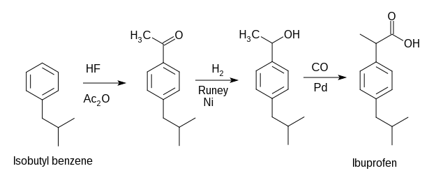
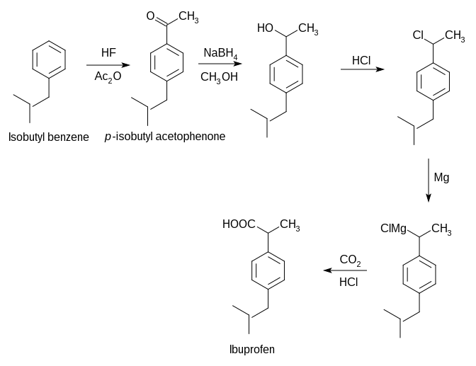
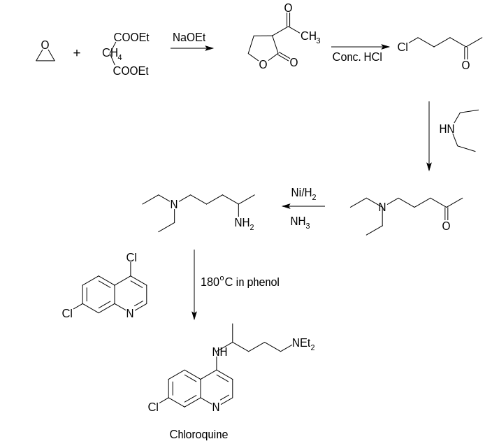

Paracetamol (Acetaminophen)
+++++++++++++++++++++++++++

Paracetamol is one of the most common analgesics. It has also the antipyretic activity and in normal doese is safe to use. However overdose may lead to severe liver damage.

The synthesis of paracetamol can be done using phenol as a starting material

.. image:: paracetamol.png
	:width: 300pt
	:height: 150pt

Ibuprofen
+++++++++

Ibuprofen is nonsteroidal anti-inflammatory drug. It works by reducing hormones that causes inflammation and pain in the body. It is used to reduce fever and fo the treatment of pain or inflammation caused by several condition such as headache. Overdoes can increate the rist of fatal heart attack or stroke.

Another way of synthesis

Chloroquine
+++++++++++

Mosquito borne parasite **Plasmodium falciparum** is the main organism for malaria. This species multiplies very rapidly within red blood cells and destroy them within one or two days. During the life cycle the parasite proteolyze hemoglobin for their nutrition. However the process releases heme, the iron cofactor with its porphyrin ring, which is toxic to the parasite. The released heme damages the cell membranes of the parasite and put inhibitive effect on the work of several enzymes. To get relief from its toxic effect the parasite converts heme to a nontoxic polymeric form, known as hemozoin. Hemozoin is stored in the food vacuoles and does not make any disturbance in their biological processes.

Chloroquine and several other quinoline containing antimalarials do affect the life cycle of the parasite by inhibiting the plasmodial heme polymerase, the enzyme responsible for the polymerization of heme to hemozoin. As a result the parasite fails to convert the toxic heme to hemozoin cannot survive when the drug is administered.

The main structural moiety in several antimalarial drug is the quinoline moiety.Structure of some of the drugs are shown here.

.. image:: antimarials.png
        :width: 300pt
        :height: 300pt

Synthesis of Chloroquine
------------------------

The total synthesis may be divided into two parts. First one consists the synthesis of heterocyclic nucleous and the second one consists of the synthesis of side chain and combination of the nucleous generated in the first part.

Synthesis of nucleus
====================

.. image:: chloroquine1.png
        :width: 300pt
        :height: 300pt

Synthesis of sidechain and combination
======================================

