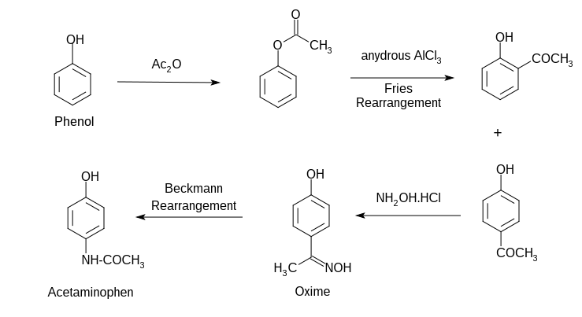

===============================
Analgesic and Antipyretic Drugs
===============================

Paracetamol (Acetaminophen)
+++++++++++++++++++++++++++

Paracetamol is one of the most common analgesics. It has also the antipyretic activity and in normal doese is safe to use. However overdose may lead to severe liver damage.

The synthesis of paracetamol can be done using phenol as a starting material

Ibuprofen
+++++++++

Ibuprofen is nonsteroidal anti-inflammatory drug. It works by reducing hormones that causes inflammation and pain in the body. It is used to reduce fever and fo the treatment of pain or inflammation caused by several condition such as headache. Overdoes can increate the rist of fatal heart attack or stroke.

.. image:: ibuprofen.png
        :width: 300pt
        :height: 150pt

Another way of synthesis

=============
Antimalarials
=============

Chloroquine
+++++++++++

Mosquito borne parasite **Plasmodium falciparum** is the main organism for malaria. This species multiplies very rapidly within red blood cells and destroy them within one or two days. During the life cycle the parasite proteolyze hemoglobin for their nutrition. However the process releases heme, the iron cofactor with its porphyrin ring, which is toxic to the parasite. The released heme damages the cell membranes of the parasite and put inhibitive effect on the work of several enzymes. To get relief from its toxic effect the parasite converts heme to a nontoxic polymeric form, known as hemozoin. Hemozoin is stored in the food vacuoles and does not make any disturbance in their biological processes.

Chloroquine and several other quinoline containing antimalarials do affect the life cycle of the parasite by inhibiting the plasmodial heme polymerase, the enzyme responsible for the polymerization of heme to hemozoin. As a result the parasite fails to convert the toxic heme to hemozoin cannot survive when the drug is administered.

The main structural moiety in several antimalarial drug is the quinoline moiety.Structure of some of the drugs are shown here.

.. image:: antimarials.png
        :width: 300pt
        :height: 300pt

Synthesis of Chloroquine
------------------------

The total synthesis may be divided into two parts. First one consists the synthesis of heterocyclic nucleous and the second one consists of the synthesis of side chain and combination of the nucleous generated in the first part.

Synthesis of nucleus
====================

.. image:: chloroquine1.png
        :width: 300pt
        :height: 300pt

Synthesis of sidechain and combination
======================================

===================================
Anti infective and Antibiotic Drugs
===================================

Antiinfective drugs are a large class of drugs that covers a broad range of inections, including fungal, viral, bacterial and even protozoal infections.

However the term antibiotic is used for those drugs that help stop infections caused by bacteria. They do this by killing the bacteria or by nhibiting the proliferation of bacteria. The term antibiotic means "against life". hence any drug that kills germs in our body is technically an antibiotic. However, by convension, it is used for expressing these drugs that kill bacteria.

Chloramphenicol
+++++++++++++++

Chloramphenicol is an antibiotic useful for the treatment of a number of bacterial infection. It was discovered in 1947 and was isolated from *Streptomyces venezuelae*. Its chemical structure was identified and was synthesised in 1949. According to the WHO's list of essential medicines, this the safest and most effective medicines needed in a health system.

Structure
---------

.. image:: chloramphenicol.png
        :width: 150pt
        :height: 150pt

Use
---

- As an eye ointment to treat conjunctivitis
- Can be administered orally or by injection into a vein and used for the treatment of meningitis, plague, cholera and typhoid fever.

Common side effects
-------------------

This includes bone marrow suppression, nausea and diarrhea.

Mode of action
--------------

Chloramphenicol is a bacteriostatic substrate that works by inhibiting protein synthesis. It prevents protein chain elongation by inhibiting peptidyl transferase activity of the bacterial ribosome.

 
